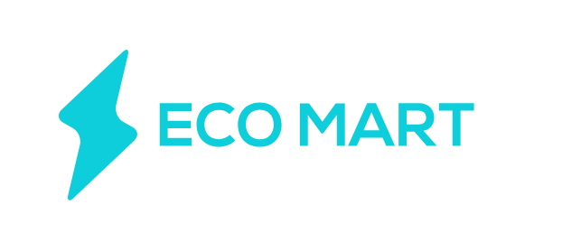

# EcoMart - Advanced Ecommerce Backend

Welcome to EcoMart, your ultimate destination for building advanced ecommerce backend solutions! 🚀

EcoMart is not just another backend project - it's a powerhouse built on Node.js, Express.js, MongoDB Atlas cluster, logger, and validation techniques. With EcoMart, you're equipped to create a robust infrastructure that rivals even the giants of the ecommerce world.

## Project Overview

EcoMart is more than just code - it's a vision. Our goal is to provide you with a comprehensive backend solution that empowers you to create an ecommerce platform that stands out from the crowd. From customer authentication to product management, order handling, reviews, category management, and feedback, EcoMart has got you covered.

## Deployment

Ready to take your project live? EcoMart backend is deployed on Render, ensuring high availability and seamless performance. Get started now by accessing our deployment at [https://ecomart-n4fw.onrender.com](https://ecomart-n4fw.onrender.com).

## Project Structure

EcoMart's project structure is designed for efficiency and scalability. We've organized our code into multiple routers, each responsible for handling specific functionalities:

- **Customer Router**: Manage customer authentication, profile management, balance operations, and profile viewing.
- **Product Router**: Handle product operations such as adding products, ordering, cart management, product search, and editing/deleting products.
- **Review Router**: Manage product reviews, including adding, updating, and deleting reviews.
- **Category Router**: Handle category operations such as adding, updating, deleting categories, searching categories, and retrieving products from specific categories.
- **Feedback Router**: Manage feedback-related operations like adding, updating, deleting, and viewing feedback.

## Usage

Getting started with EcoMart is a breeze:

1. Clone the repository to your local machine.
2. Install dependencies using `npm install`.
3. Configure environment variables such as MongoDB connection URI, secret keys, etc., in a `.env` file.
4. Run the server using `npm start`.

## Additional Information

Stay connected with EcoMart for the latest updates, tips, and tricks:

- Follow us on [Twitter](https://twitter.com/AkshandraSingh7) for news and announcements.
- Connect with us on [Instagram](https://www.instagram.com/akshandrasingh/) for behind-the-scenes glimpses and project insights.

## Contribution

Join us in shaping the future of ecommerce backend solutions! Contributions to the EcoMart project are welcome. If you encounter any issues or have suggestions for improvements, don't hesitate to open an issue or submit a pull request.

Let's build the future of ecommerce together! 🛒✨
